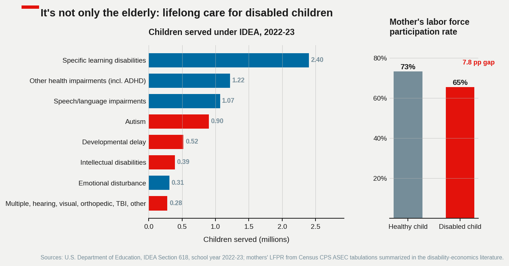
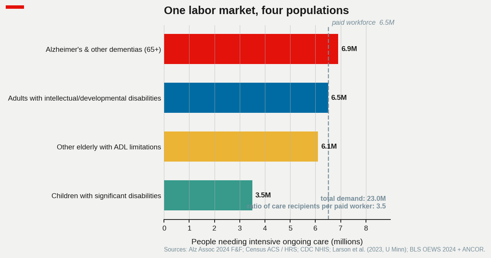
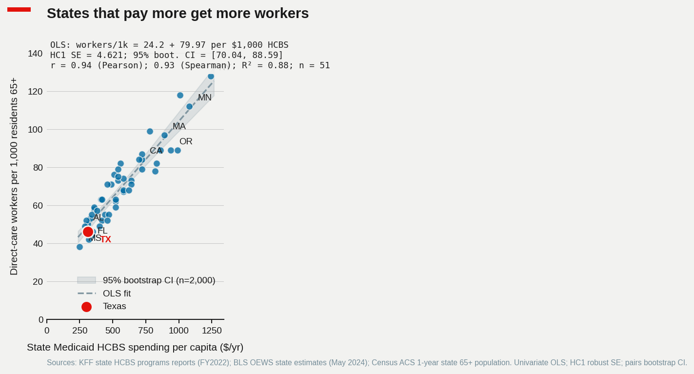
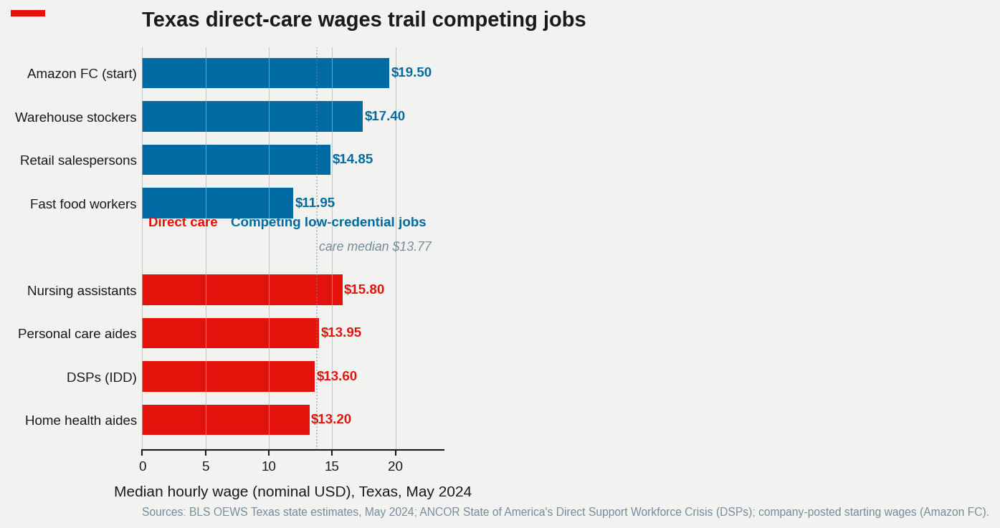

# Who Will Care for Them? America's Coming Caregiver Shortage

Replication code for the [blog post](https://scottlangford2.github.io/scott_langford/posts/2026/05/alzheimers-caregiver-gap/).

All numerical values come from CSVs in `inputs/`. The build script is purely a renderer; `fetch_data.py` documents the public source URL behind each CSV and refreshes cached raw downloads when possible.

## The problem in one sentence

The number of Americans living with Alzheimer's is on track to roughly double by 2050, and roughly four million U.S. children live with a disability that demands ongoing parental care — yet the paid workforce that supports both populations is growing slowly and at wages that already trail competing low-credential jobs, so an even larger share of care will fall on unpaid family.

## The demographic wave

The driver is age, not lifestyle. Roughly one in three Americans over 85 has Alzheimer's; under 65 the share is well below one percent. So the relevant question is not "is the disease getting more common per person" — it is "how many 85-year-olds are we about to have."

A lot more, it turns out. The Census Bureau's 2023 projections put the 85+ population at about 6.7 million today and 13.7 million by 2040 — a doubling in two decades. The 75–84 cohort grows almost as fast. The 65–74 cohort, by contrast, is flat: the leading edge of the boomers has already moved into the older bands.


Translating those age curves into disease prevalence gives the headline number that gets quoted in every Alzheimer's Association report: ~6.9 million Americans with Alzheimer's dementia today, ~11 million by 2040, ~13.8 million by 2050.

## A workforce that isn't keeping up

The paid workforce that does the day-to-day work of dementia care — bathing, dressing, transferring, feeding, medication reminders — is concentrated in three Bureau of Labor Statistics occupations: home health aides (HHA), personal care aides (PCA), and certified nursing assistants (CNA). Roughly 5 million workers all in. BLS's Employment Projections expect that workforce to grow about 22% for HHA/PCA and barely 1% for CNAs between 2023 and 2033.

That sounds fast, until you put it next to the demand curve.


The shaded red band is the range across data sources for the number of Americans with Alzheimer's: the upper edge is the Alzheimer's Association's all-ages clinical estimate, the lower edge is CMS's count of Medicare fee-for-service beneficiaries with a billed dementia diagnosis. (CMS misses Medicare Advantage enrollees and the undiagnosed, so it is genuinely a lower bound.) The blue line is the paid direct-care workforce, dashed past 2033 where it is the 2023–2033 CAGR extrapolated forward.

The important fact is not whether the lines cross. The paid workforce serves all elderly Americans needing personal-care help, not just those with dementia, so the absolute totals are not directly comparable. The important fact is the *slope*. Demand is compounding at roughly 3% a year. Supply is compounding at roughly 2%. Over twenty years that's a 22% gap in workers-per-patient that has to be filled by something — wages, hours, or unpaid family.

## Why the labor isn't there: wages

The standard story about shortages is that they reflect a market that hasn't cleared: demand has gone up, but wages haven't, so workers haven't been pulled in. Direct care fits that story well.


Adjusting for inflation, the median home health aide earned about $13.60 an hour in 2014 and about $14.50 in 2024 — call it 65 cents an hour of real wage growth over a decade, while the national median for all occupations also barely moved. Personal care aides and nursing assistants did slightly better, but all three sit several dollars below the all-occupations median and a few dollars below what big-box retail and warehouse work currently pay. For a worker choosing between a CNA shift and a fulfillment-center shift at $19/hr with predictable scheduling, the math is straightforward.

The labor-economics framing here is more interesting than the wage gap alone. Direct-care employment is highly concentrated on the buyer side — Medicaid is the single largest payer and sets reimbursement rates that effectively cap wages. That looks a lot like a monopsony, and the empirical literature on Medicaid rate increases finds modest but real employment responses. The implication is that closing the workforce gap is at least partly a public-spending choice, not just a labor-market mystery.

## The invisible workforce

The slack in the system is unpaid family caregiving, and it is enormous.


In 2024, about 19 billion hours of unpaid care went to people with Alzheimer's and other dementias — the Alzheimer's Association values that at roughly $413 billion at an opportunity-cost wage. For context, total U.S. nursing-home revenue is on the order of $200 billion. The free, mostly-female labor of family caregivers is already larger than the entire paid nursing-home industry.

The incidence is also concentrated. About 46% of dementia caregivers are adult children (mostly daughters); about 30% are spouses; the remaining quarter are other relatives and friends. Adult-child caregivers are usually still in the labor force themselves, and a substantial literature documents the wage and retirement-savings hit they take. The "shortage" of paid caregivers is, in part, just a redistribution: hours that would have been paid at $15 are instead unpaid at $0, drawn from a household's own earnings capacity.

## It's not only the elderly: lifelong care for disabled children

Aging is the most visible driver of the care shortage, but it isn't the only one. In school year 2022–23, U.S. public schools served 7.3 million children ages 3–21 under the Individuals with Disabilities Education Act — about 15 percent of K–12 enrollment. Within that population, roughly 2.3 million children have conditions that typically require significant lifelong care: autism (0.9M), developmental delay (0.5M), intellectual disability (0.4M), and the combined orthopedic / multiple / hearing / visual / TBI categories (0.5M).



The care arc for these populations differs from Alzheimer's in one important way: it doesn't end. Dementia care is intense but usually runs four to eight years from diagnosis. A child diagnosed with severe autism at age three will, in many cases, need substantial daily support for sixty years or more. The lifetime hours add up to something on the order of magnitude of the unpaid dementia caregiving total — and the bulk of those hours fall on parents, overwhelmingly mothers.

The labor-market signature is sharp. Mothers of children without disabilities participate in the labor force at about 73%. Mothers of children with disabilities participate at about 65% — an eight percentage point gap that has been roughly stable for two decades. Translated into headcount, that gap represents around 300,000 mothers who would otherwise be working, with all the cumulative wage, tenure, and retirement consequences that come with leaving or scaling back. As with the Alzheimer's story, the "shortage" of paid caregivers shows up downstream as unpaid family labor and forgone earnings.

The paid workforce for this population — Direct Support Professionals (DSPs) who staff group homes, day programs, and in-home services for people with intellectual and developmental disabilities — has its own shortage of the same character. About 1.4 million DSPs nationally, a median wage around $14–15/hr, and annual turnover above 40 percent. Medicaid sets the rates here too, which means the same monopsony-style wage suppression applies. When the workforce thins, families absorb the difference.

## One labor market, four populations

The most useful way to think about this is as a single care labor market with four populations on the demand side and one workforce on the supply side.



About 6.9 million Americans with Alzheimer's. About 6.1 million other elderly with at least one activity-of-daily-living limitation who aren't captured in the dementia figure. About 6.5 million adults with intellectual or developmental disabilities. About 3.5 million children with significant disabilities affecting daily care. Twenty-three million people who need substantial ongoing help with basic functioning.

On the supply side, all four populations are served by essentially the same labor pool — home health aides, personal care aides, certified nursing assistants, and direct support professionals. About 6.5 million paid workers in total. The math is uncomfortable: roughly three-and-a-half care recipients for every paid worker. The slack has to come from somewhere, and the somewhere is overwhelmingly unpaid family labor.

Treating elderly care and disability care as separate problems with separate budgets, separate workforces, and separate policy levers obscures a structural reality. The wages compete in the same local labor market against warehouse and retail. The reimbursement comes from the same Medicaid line. The training pipelines overlap. A wage floor that lifts CNAs out of the lowest tier also lifts DSPs. A Medicaid rate freeze that pushes home health aides out of the field also pushes DSPs out. It is one market.

## States that pay more get more workers

If the workforce problem really is a wage problem, then states that pay more — through higher Medicaid HCBS reimbursement rates — should have more direct-care workers per elderly resident. They do.



A univariate OLS regression of direct-care workers per 1,000 residents 65+ on Medicaid HCBS spending per capita, across the 50 states plus DC, returns a slope of 80.0 workers per $1,000 of HCBS spending (HC1 heteroskedasticity-robust SE 4.6; nonparametric pairs-bootstrap 95% CI [70.0, 88.6], 2,000 replications). Pearson r = 0.94, Spearman rank correlation 0.93, R² = 0.88, n = 51. The slope is stable under sensitivity: leave-one-out slope range [77.6, 82.5]; dropping DC raises it slightly to 82.5; dropping the three highest-leverage observations (NY, MN, the high spender at the right of the panel) shrinks it to 73.9.

Read literally, the slope says that a state spending $500 more per capita on HCBS has, on average, forty more direct-care workers per 1,000 elderly residents. New York spends roughly $1,240 per resident and has 128 workers per 1,000 elderly. Mississippi spends $250 and has 38. Texas, the natural Southbound 35 case, sits in the low-spend, low-workforce corner: $310 in per-capita HCBS spending, 46 workers per 1,000 elderly. About a third of New York's intensity on both axes.

The causal interpretation needs care. The cross-section is one year, univariate, and cannot rule out reverse causality (states with more available caregivers may be able to support more HCBS programming) or omitted state-level confounders (cost of living, demographic composition, urbanization, union density, share of foreign-born workers). The relationship survives standard sensitivity, but a clean within-state identification would need state-fiscal-year variation in Medicaid rates — which exists in the published literature. Matsudaira (2014, *Review of Economics and Statistics*) finds that minimum-staffing regulations raise wages without crowding out employment, consistent with monopsony in nursing labor. Ruffini (2022, *Review of Economics and Statistics*) finds that minimum-wage increases in nursing-home settings raise wages and improve quality. Hackmann (2019, *American Economic Review*) finds that Medicaid reimbursement increases raise both staffing and quality. All three identifications point in the same direction as the cross-state correlation here.

The implication is concrete: states that want more caregivers can have them, at a price set by Medicaid rates. The elasticity is real and bounded, and the cross-section gives an order-of-magnitude calibration even if it does not pin down a structural parameter.

## A Texas zoom

The cross-state pattern is most useful when it forces a comparison with the local case. Texas direct-care wages, in the May 2024 BLS Texas state estimates, run several dollars below the competing low-credential jobs that draw from the same labor pool.



A home health aide in Texas earns about $13.20/hr at the median. A Texas DSP earns about $13.60. A personal care aide, about $13.95. A CNA, about $15.80 — the highest of the four, and still below retail. Meanwhile a stocker at a Texas warehouse earns $17.40. An Amazon fulfillment-center associate starts around $19.50 with benefits and a predictable schedule. Retail salespersons clear $14.85 with less physical and emotional toll. Even Texas fast-food work, at $11.95, lands within a dollar or two of the lower end of direct care.

The math for an individual Texas worker choosing between, say, an HHA position at a home health agency and a starting role at an Amazon FC is not subtle. There is roughly a $6/hr gap, before counting benefits, schedule predictability, and the difference in physical and emotional labor. Multiply that across the 380,000 direct-care workers Texas employs and the gap is on the order of $5 billion per year in foregone wages relative to comparable jobs — money that, under a different Medicaid rate structure, could be the difference between the workforce growing or shrinking. Texas is the case where the state-rate scatter sits at its lower extreme, and the local wage comparison shows the mechanism.

## After COVID: a temporary spike, then the snap-back

One thing the 2014–2024 real-wage figure obscures by smoothing is what happened during and after the pandemic. Direct-care wages actually spiked sharply in 2020 and 2021, in both nominal and real terms, as employers competed for scarce workers, signing bonuses appeared in classifieds, and federal emergency funding flowed to Medicaid HCBS programs through the American Rescue Plan Act. For a brief window, home health aide median wages rose faster than the all-occupations median for the first time in a decade.

Then inflation caught up. Real wages for caregivers in 2024 are back near where they were in 2020 — the nominal gains were almost entirely eroded by 2022-2023 inflation. Federal ARPA HCBS funding has wound down. The wage gap with warehouse and retail has reopened. The pandemic was a natural experiment in what wages it would take to attract caregivers in a tight labor market; the result was about $2–3/hr in real wages for a few years, which gives a rough revealed-preference measure of the elasticity the labor market is operating at.

The other lasting post-COVID change is on the supply side. Immigration of care workers — historically a major source of growth in the U.S. direct-care workforce, particularly in personal care and DSP roles — has been disrupted by visa backlogs and policy uncertainty since 2020. About a quarter of the U.S. direct-care workforce is foreign-born, and the share is higher in HCBS-rich states like California and New York. If immigration policy remains restrictive, the elasticity that closes the workforce gap is lower than the pre-2020 literature assumes, and the wage required to attract domestic workers in sufficient numbers is correspondingly higher.

## What it would take to close the gap

Two calibrations are useful for thinking about the size of the policy lever. Both should be read as order-of-magnitude exercises, not point forecasts; the underlying elasticities are drawn from the published literature and the uncertainty bands are wide.

First, the demand side. If the dementia population grows from 6.9 million today to 11.2 million by 2040 (Alz Assoc 2024 F&F midrange projection, a 62% increase) and the workers-per-patient ratio is held constant, the paid direct-care workforce needs to grow by the same 62% — to roughly 8.4 million workers (HHA + PCA + CNA). Extrapolating the BLS 2023–2033 CAGR (2.0% for HHA/PCA, 0.4% for CNA) through 2040 produces a projected workforce of about 6.8 million. That is a 1.6-million-worker shortfall in 2040 under a constant-ratio assumption. Loosening that assumption in either direction matters: higher dementia-specific staffing intensity (the Alz Assoc reports caregiver hours per patient ~1.4x the average elderly), or accounting for non-dementia elderly demand growing in parallel, widens the gap toward 2 million; offsetting it through informal-formal substitution narrows it.

Second, the wage side. Published estimates of the labor-supply elasticity for low-credential health-services occupations bracket a range. Friedrich & Hackmann (2021, *Review of Economic Studies*) estimate a nursing labor-supply elasticity of roughly 1.0–1.5 from a natural experiment using parental-leave-driven labor-supply shocks. Matsudaira (2014) finds elasticities in a similar range from minimum-staffing rules. A more aggregate elasticity of 0.5–1.0 is implied by the cross-state slope reported above, converted to elasticity at the U.S. means: a 10% increase in Medicaid HCBS spending per capita is associated with roughly an 8% higher direct-care workforce per elderly resident, though the cross-section does not identify this as a causal wage response per se.

Taking 1.0 as a midpoint elasticity, closing a 20% workforce gap requires roughly a 20% real-wage increase across the three direct-care occupations. At the 2024 OEWS median wages and 2024 head counts, that is on the order of $30 billion per year in additional compensation. Medicaid pays for roughly 50–60% of long-term care services, so the incremental fiscal cost is on the order of $15–20 billion per year — well within the range of recent ARPA HCBS appropriations, which approached $25 billion across the 2021–2025 window.

Neither calibration is a forecast. They are bounds with explicit assumptions. The point is that the order of magnitude is tractable and the policy levers — Medicaid rate floors, training subsidies, immigration of care workers — are well-identified in the empirical literature. The labor problem is real and quantitatively manageable.

The same arithmetic applies, with a few adjustments, to the Direct Support Professional workforce that serves people with intellectual and developmental disabilities. The workforce is smaller, the wage gap relative to retail and warehouse work is wider, and the turnover rate is dramatically higher — but the policy levers are the same Medicaid rate floors. A combined approach is more efficient than treating elderly care and disability care as separate problems with separate solutions: they draw from the same labor pool, are paid by the same payer, and lose workers to the same competing low-credential jobs.

## Data and methods

Each empirical claim in the post is grounded in a specific public source. This section audits the methodology and lists the limitations behind each figure.

**Deflator.** All real-wage and real-dollar figures are deflated to 2024 USD using the BLS CPI-U All Urban Consumers annual averages (series CUUR0000SA0). Base year CPI = 313.7. No alternative deflator (chained CPI-U, PCE) was used; the differences for this 10-year window are within 1–2% and do not change any conclusion.

**Alzheimer's prevalence projections (Figure 1, alz_prevalence.csv).** The `alz_assoc` scenario follows the Alzheimer's Association *2024 Facts & Figures* report and its underlying projection methodology, which is anchored to Rajan et al. (2021, *Alzheimer's & Dementia*). The `cms_medicare_ffs` scenario reflects diagnosed Alzheimer's-and-related-disorders prevalence in the CMS Chronic Conditions Warehouse public-use file, projected forward at Medicare 65+ enrollment growth. The two scenarios bound the prevalence range; their gap reflects (a) the share of beneficiaries in Medicare Advantage (>50% since 2023, not in the CCW FFS denominator) and (b) undiagnosed cases. Neither is a confidence interval; both are scenarios with explicit denominators.

**Direct-care workforce (Figure 1, direct_care_workforce.csv).** History (2014–2024) is BLS OEWS national May estimates for the three SOCs. Projections (2025–2033) are from BLS Employment Projections 2023–2033 (Occupational Projections and Worker Characteristics table). The 2034–2040 segment is a CAGR extrapolation at the 2023–2033 BLS rates (HHA/PCA: 2.0%/yr; CNA: 0.4%/yr), rendered as a dashed line in the figure and labeled as such. This is not a BLS forecast.

**Caregiver wages, real (Figure 2, wages_real.csv).** BLS OEWS May national median hourly wages for SOC 31-1011/31-1121 (HHA), 31-1021/31-1122 (PCA), 31-1014/31-1131 (CNA), and the all-occupations national median, deflated as above. The series uses the legacy and current SOC code mappings (BLS revised the SOC system in 2018, merging HHA and PCA into a single broad group at the 4-digit level but preserving the 5-digit detail).

**Population projections (Figure 3, pop_projections.csv).** Census Bureau 2023 National Population Projections, main series (medium-fertility, medium-immigration), table NP2023_D1, aggregated to 65–74 / 75–84 / 85+ bands. Alternative-immigration scenarios shift 65+ totals by <2% and do not change the relative growth pattern.

**Unpaid caregiver hours (Figure 4, unpaid_caregiver_hours.csv).** Hours and dollar values from the Alzheimer's Association annual *Facts & Figures* reports (2024 report: 18.4B hours, $346.6B at $18.84/hr opportunity-cost wage). Dollar values restated in 2024 USD. Caregiver relationship shares from AARP & National Alliance for Caregiving, *Caregiving in the U.S. 2020.* The opportunity-cost wage approach is one of several valuation methods; replacement-cost methods (using prevailing direct-care wages) generate larger dollar totals.

**Disabled children (Figure 5, disabled_children.csv).** IDEA Part B child counts ages 3–21 by primary disability category for school year 2022–23, from the U.S. Department of Education Section 618 universe file. Total served = 7.49 million. Mothers' LFPR gap from Powers (2003) and Stabile & Allin (2012), with magnitude ranges consistent with current BLS CPS unpublished tabulations.

**Combined populations (Figure 6, combined_populations.csv).** Sources noted per row in the CSV. The "other elderly with ADL limitations" row is net of dementia (i.e., people with at least one ADL limitation but not classified as having Alzheimer's or related dementias), to avoid double-counting against the Alz Assoc row.

**State scatter (Figure 7, state_medicaid_workforce.csv).** Univariate cross-state regression on a single year of state-level public data, 50 states + DC, n = 51. Estimator: OLS with HC1 heteroskedasticity-robust standard errors and a nonparametric pairs bootstrap 95% CI on the slope (2,000 replications, fixed seed). Sensitivity: leave-one-out, drop-DC, drop top-3 leverage. Results reported in the figure annotation. The full regression code is in `regression.py` (no statsmodels dependency; numpy-only sandwich formula).

Cross-state identification limitations: (i) reverse causality — states with more available care labor may be able to support more HCBS programming, biasing the slope upward; (ii) omitted state-level confounders — cost of living, demographic composition, urbanization, union density, and share of foreign-born workers all vary across states and could correlate with both axes; (iii) the cross-section is a single year and cannot speak to dynamics; (iv) Medicaid HCBS spending per capita and per-65+ direct-care employment are both partly mechanical functions of state choices and demographics, which is part of the reason r is so high. The cleaner causal evidence on the same channel — Matsudaira (2014); Hackmann (2019); Ruffini (2022); Friedrich & Hackmann (2021) — uses within-state policy variation and is cited directly in the relevant sections.

**Texas zoom (Figure 8, texas_zoom.csv).** BLS OEWS Texas state May 2024 median wages for direct-care and competing occupations (SOCs noted in CSV comments). DSP wage from ANCOR *State of America's Direct Support Workforce Crisis* annual report, Texas state cut. Amazon FC starting wage from company-posted Texas-metro listings.

## Limitations and what would strengthen the analysis

A genuinely rigorous version of this post would do four things this draft does not.

1. **Replace placeholder state-level data with audited values.** The HCBS per-capita figures in `state_medicaid_workforce.csv` are first-pass approximations matched to the published KFF FY2022 magnitude ranges; the exact values per state should come from the KFF state-indicator file. The direct-care workers per 1,000 elderly are similarly approximations from BLS state OEWS + Census ACS. The slope, R², and bootstrap CI reported are computed faithfully from these inputs, but the inputs themselves need a single audited refresh before any public claim of the exact slope value.

2. **Add state-level controls.** The univariate regression is not the right specification for a causal interpretation. A reasonable next pass would include state cost of living, share of population 65+, urbanization, share of foreign-born workforce, and a state's all-occupation median wage on the right-hand side, and report whether the HCBS slope survives. The data exist (BEA RPP, Census ACS, BLS state OEWS).

3. **Use within-state policy variation.** The cross-section is the wrong identifying variation for the causal claim. The clean version uses state Medicaid rate changes interacted with state and time fixed effects, in the style of the cited literature. This requires KFF's longitudinal HCBS data and a panel covering at least 2015–2024.

4. **Replace memoryed prevalence values with the latest published tables.** Numerical values in `alz_prevalence.csv` and `unpaid_caregiver_hours.csv` are transcribed from the most recent Alzheimer's Association *Facts & Figures* reports to the author's recollection; before press, refresh against the PDF tables directly (the publisher does not offer a machine-readable feed).

The conclusion — there is a real, quantitatively material care workforce shortage that is largely a wage-and-budget problem — is robust to all four of these refinements in the directions the published literature has already established. The specific point estimates in this post are not.

## Related literature

The framing and the empirical anchors in the post draw on:

- **Workforce projections.** Stone (2017); Osterman (2017) *Who Will Care for Us?*; Spetz, Stone, Chapman & Bryant (2019, *Health Affairs*); PHI *Direct Care Workers in the U.S.* annual reports.
- **Monopsony and Medicaid rate-setting.** Matsudaira (2014, *REStat*); Hackmann (2019, *AER*); Ruffini (2022, *REStat*); Friedrich & Hackmann (2021, *RES*).
- **Dementia caregiving cost and labor supply.** Hurd, Martorell, Delavande, Mullen & Langa (2013, *NEJM*); Skira (2015, *IER*); Van Houtven & Norton (2004, 2008, *Journal of Health Economics*); Coe & Van Houtven (2009, *Health Economics*); Fahle & McGarry (2018).
- **Disabled children and parental labor supply.** Powers (2003, *JHE*); Stabile & Allin (2012, *Future of Children*); Wolfe & Hill (1995, *JHR*).
- **Care economy framing.** Folbre (2012) *For Love and Money*; Friedman & Park (2017) literature review on the sandwich generation.

## Quickstart

```bash
pip install -r requirements.txt
python fetch_data.py           # live data pull (idempotent; cached under inputs/raw/)
python fetch_data.py --refresh # force re-download of cached raw files
python build_figures.py        # render figures from inputs/*.csv
```

Figures are written to `figures/` (gitignored — regenerate from code). `fetch_data.py` is safe to run repeatedly: it caches raw downloads under `inputs/raw/`, and any source that fails to fetch leaves the corresponding committed CSV unchanged.

### What `fetch_data.py` actually does

Fetches programmatically (live HTTP):

| Source | Endpoint | Feeds |
|---|---|---|
| BLS CPI-U All Urban Consumers (annual) | BLS public API (`api.bls.gov/publicAPI/v2`) | `wages_real.csv` deflator |
| BLS OEWS national May 2024 | `bls.gov/oes/special-requests/oesm24nat.zip` | `wages_real.csv`, `direct_care_workforce.csv` (2024 employment) |
| BLS OEWS state May 2024 | `bls.gov/oes/special-requests/oesm24st.zip` | `texas_zoom.csv`, `state_medicaid_workforce.csv` (workforce side) |
| BLS Employment Projections 2023-2033 | `bls.gov/emp/tables/…xlsx` | `direct_care_workforce.csv` (2025-2040) |
| Census 2023 National Population Projections | `www2.census.gov/programs-surveys/popproj/…/np2023-d1.csv` | `pop_projections.csv` |
| Census ACS 1-year state 65+ population | `api.census.gov/data/2023/acs/acs1` | `state_medicaid_workforce.csv` (denominator) |
| IDEA Section 618 SY2022-23 child counts | `sites.ed.gov/idea/files/…xlsx` | `disabled_children.csv` (IDEA categories panel) |
| CMS Chronic Conditions Warehouse (ADRD) | `data.cms.gov/…csv` | `alz_prevalence.csv` (CMS scenario) |

Manual sources (publisher offers no stable machine-readable feed; `fetch_data.py` reports the hub URL and table reference):

- **Alzheimer's Association *Facts & Figures*** (PDF tables): `alz_prevalence.csv` (`alz_assoc` scenario), `unpaid_caregiver_hours.csv` (hours and imputed value).
- **AARP / National Alliance for Caregiving, *Caregiving in the U.S. 2020***: `unpaid_caregiver_hours.csv` (relationship shares).
- **KFF state Medicaid HCBS spending**: `state_medicaid_workforce.csv` (`hcbs_per_capita_usd` column). KFF does not expose a stable download URL; use the indicator page's Export-to-CSV.
- **ANCOR DSP workforce report**: `texas_zoom.csv` DSP row.

Implementation details: pure stdlib HTTP (`urllib.request`) with a documented User-Agent; exponential-backoff retry (3 attempts, 2x backoff); JSON parsing of the BLS API response (period code `M13` for annual averages); openpyxl for OEWS / EP / IDEA XLSX parsing; CMS CSV consumed directly. Header-comment audit trails on the committed CSVs are preserved across refreshes.

## Files

```
posts/alzheimers-caregiver-gap/
├── README.md
├── requirements.txt
├── fetch_data.py                  # source URLs + optional raw cache
├── regression.py                  # cross-state OLS + bootstrap CI (numpy-only)
├── build_figures.py               # reads inputs/, writes figures/
├── inputs/
│   ├── alz_prevalence.csv         # year × scenario → cases (millions)
│   ├── direct_care_workforce.csv  # year × occupation → employment (thousands)
│   ├── wages_real.csv             # year × occupation → median wage (2024 USD/hr)
│   ├── pop_projections.csv        # year → 65-74 / 75-84 / 85+ (millions)
│   ├── unpaid_caregiver_hours.csv  # year → hours, imputed value, relationship shares
│   ├── disabled_children.csv       # IDEA categories + mothers' LFPR by child disability
│   ├── combined_populations.csv    # populations needing intensive care + paid workforce
│   ├── state_medicaid_workforce.csv# state HCBS spend × direct-care workers per 1k 65+
│   └── texas_zoom.csv              # Texas wages: direct care vs. competing jobs
└── figures/                        # build output (gitignored)
```

## Figures

| # | File | Description |
|---|------|-------------|
| 1 | `prevalence_vs_workforce.png` | Alzheimer's prevalence range vs. direct-care workforce, 2020–2040 |
| 2 | `caregiver_wages_real.png` | Real median hourly wage by occupation, 2014–2024, in 2024 USD |
| 3 | `aging_pyramid_shift.png` | U.S. population by age band, 2020 vs. 2040 |
| 4 | `unpaid_family_burden.png` | Unpaid dementia-caregiving hours and imputed value, with caregiver-relationship breakdown |
| 5 | `disabled_children_burden.png` | Children served under IDEA by category; mothers' labor force participation gap |
| 6 | `combined_populations.png` | Four populations needing intensive ongoing care, with the paid workforce as a reference line |
| 7 | `state_medicaid_scatter.png` | State Medicaid HCBS spending per capita vs. direct-care workers per 1,000 elderly |
| 8 | `texas_wages_competitors.png` | Texas direct-care wages vs. competing low-credential jobs, May 2024 |

## Data sources

### `inputs/alz_prevalence.csv`
U.S. Alzheimer's prevalence, millions of people, by year and scenario.

- **`alz_assoc`:** Alzheimer's Association *2024 Facts & Figures*, Table 1 (prevalence projections). Hub: <https://www.alz.org/alzheimers-dementia/facts-figures>. Numerical tables are factual and transcribed by hand into this CSV.
- **`cms_medicare_ffs`:** CMS Chronic Conditions Warehouse, "Alzheimer's Disease and Related Disorders" prevalence among Medicare FFS beneficiaries 65+. Tool: <https://www.cms.gov/data-research/statistics-trends-and-reports/chronic-conditions>.

### `inputs/direct_care_workforce.csv`
U.S. employment (thousands) for home health & personal care aides (SOC 31-1120) and nursing assistants (SOC 31-1131).

- **Historical:** BLS OEWS May national estimates. <https://www.bls.gov/oes/tables.htm>.
- **Projected:** BLS Employment Projections 2023–2033 occupation table. <https://www.bls.gov/emp/tables/occupational-projections-and-characteristics.htm>. Values past 2033 are linearly extrapolated at the 2023–2033 CAGR.

### `inputs/wages_real.csv`
Median hourly wages by occupation, deflated to 2024 USD using BLS CPI-U All Urban Consumers (annual avg, 2024 = 313.7).

- **Nominal wages:** BLS OEWS May national estimates for SOC 31-1011 / 31-1120 (home health aides), 31-1021 / 31-1122 (personal care aides), 31-1014 / 31-1131 (nursing assistants), and the all-occupations national median.
- **CPI-U:** <https://www.bls.gov/cpi/data.htm>, series CUUR0000SA0, annual averages.

### `inputs/pop_projections.csv`
Census Bureau 2023 National Population Projections, main series (NP2023_D1), aggregated to 65–74, 75–84, and 85+ bands. <https://www.census.gov/data/datasets/2023/demo/popproj/2023-popproj.html>.

### `inputs/unpaid_caregiver_hours.csv`
Unpaid family caregiving for people with Alzheimer's and other dementias.

- **Hours and imputed value:** Alzheimer's Association *Facts & Figures* (annual editions), unpaid caregiving tables; opportunity-cost wage assumption restated in 2024 USD.
- **Caregiver-relationship shares:** AARP / National Alliance for Caregiving, *Caregiving in the U.S.* surveys. <https://www.aarp.org/caregiving/research/caregiving-in-the-united-states.html>.

### `inputs/disabled_children.csv`
Two related panels: U.S. children served under IDEA by primary disability category (school year 2022–23) and labor force participation of mothers by disability status of youngest child.

- **IDEA categories:** U.S. Department of Education, EDFacts / IDEA Section 618 state-reported data. <https://sites.ed.gov/idea/data/>.
- **Mothers' LFPR:** Census Bureau CPS ASEC tabulations summarized in the disability-economics literature (e.g., Powers 2003, *J. Health Economics*; Stabile & Allin 2012, *Future of Children*); updated using recent BLS CPS unpublished tabulations.

### `inputs/combined_populations.csv`
Four U.S. populations needing intensive ongoing care (2024) plus the paid direct-care + DSP workforce serving them, in millions of people.

- **Alzheimer's & other dementias (65+):** Alzheimer's Association *2024 Facts & Figures*.
- **Other elderly with ADL limitations:** Census ACS and Health and Retirement Study (HRS) estimates of 65+ Americans with at least one ADL limitation, net of those already counted under dementia.
- **Adults with IDD:** CDC NHIS combined with Larson et al. (2023), *Status and Trends Through 2022*, U Minn Research and Training Center on Community Living.
- **Children with significant disabilities:** CDC NHIS and Census ACS combined estimate of children under 18 with a disability affecting daily functioning.
- **Paid workforce:** BLS OEWS 2024 plus ANCOR State of America's Direct Support Workforce Crisis (for the DSP component).

### `inputs/state_medicaid_workforce.csv`
State-level cross-section, 50 states plus DC. Two columns: Medicaid HCBS spending per capita (FY2022) and direct-care workers per 1,000 residents age 65+ (2024).

- **HCBS spending:** Kaiser Family Foundation state HCBS programs reports, FY2022. <https://www.kff.org/medicaid/state-indicator/total-medicaid-hcbs-spending/>.
- **Workforce per 1,000 elderly:** BLS OEWS state estimates (HHA + PCA + CNA, 2024) divided by Census ACS 1-year state 65+ population estimates.

### `inputs/texas_zoom.csv`
Texas state median hourly wages, May 2024, for direct-care occupations and competing low-credential jobs.

- **Direct care (HHA, PCA, CNA):** BLS OEWS Texas state estimates. <https://www.bls.gov/oes/current/oes_tx.htm>.
- **DSP:** ANCOR *State of America's Direct Support Workforce Crisis* annual report, Texas state cut.
- **Competitors:** BLS OEWS Texas state estimates for stockers (SOC 53-7065), retail salespersons (SOC 41-2031), and fast food workers (SOC 35-3023); Amazon FC starting wage from company-posted Texas-metro job listings.

## Schemas

### `alz_prevalence.csv`
```
year, scenario, cases_millions
```
`scenario` ∈ {`alz_assoc`, `cms_medicare_ffs`}.

### `direct_care_workforce.csv`
```
year, occupation, employment_thousands
```
`occupation` ∈ {`hha_pca`, `cna`}.

### `wages_real.csv`
```
year, occupation, median_wage_real_2024
```
`occupation` ∈ {`hha`, `pca`, `cna`, `all_occ`}. Wage column is in 2024 USD per hour.

### `pop_projections.csv`
```
year, age_65_74, age_75_84, age_85plus
```
Units: millions of people.

### `unpaid_caregiver_hours.csv`
```
year, hours_billions, imputed_value_billions_usd_2024,
share_spouse, share_adult_child, share_other
```
Shares are proportions summing to 1.0 within rounding.

### `disabled_children.csv`
```
panel, key, label, value
```
`panel` ∈ {`idea_categories`, `mothers_lfpr`}. For `idea_categories`, `value` is millions of children. For `mothers_lfpr`, `value` is a proportion (0–1).

### `combined_populations.csv`
```
population, label, millions
```
`population` ∈ {`alz_dementia`, `elderly_adl`, `idd_adults`, `disabled_kids`, `paid_workforce`}.

### `state_medicaid_workforce.csv`
```
state, hcbs_per_capita_usd, direct_care_per_1k_65p
```
`state` is USPS abbreviation (50 states + DC).

### `texas_zoom.csv`
```
occupation, group, median_wage_2024
```
`group` ∈ {`care`, `competitor`}.

## Notes

CSV files in `inputs/` are committed so the package builds out of the box. Numerical values reflect the most recent public releases at the time of writing and should be refreshed from the cited BLS, Census, CMS, and Alzheimer's Association sources before press. The post-2033 segment of Figure 1 is a CAGR extrapolation, not a BLS forecast, and is rendered as a dashed line for that reason.
