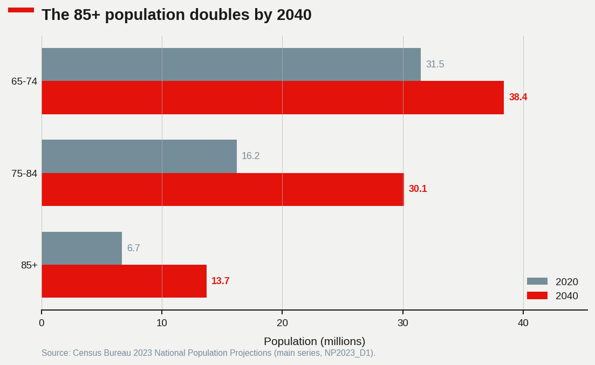
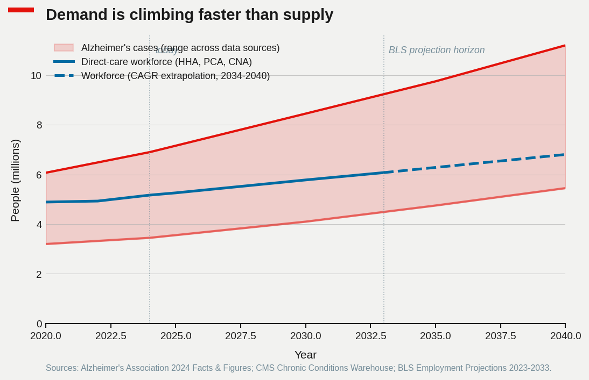
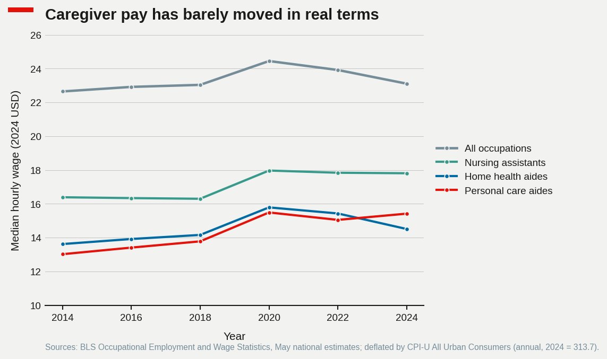
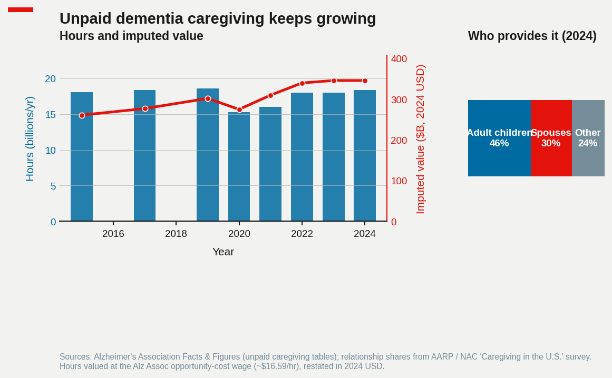

# Who Will Care for Them? America's Coming Alzheimer's Caregiver Shortage

Replication code for the [blog post](https://scottlangford2.github.io/scott_langford/posts/2026/05/alzheimers-caregiver-gap/).

All numerical values come from CSVs in `inputs/`. The build script is purely a renderer; `fetch_data.py` documents the public source URL behind each CSV and refreshes cached raw downloads when possible.

## The problem in one sentence

The number of Americans living with Alzheimer's is on track to roughly double by 2050, while the paid workforce that cares for them is growing slowly and at wages that already trail competing low-credential jobs — so an even larger share of care will fall on unpaid family.

## The demographic wave

The driver is age, not lifestyle. Roughly one in three Americans over 85 has Alzheimer's; under 65 the share is well below one percent. So the relevant question is not "is the disease getting more common per person" — it is "how many 85-year-olds are we about to have."

A lot more, it turns out. The Census Bureau's 2023 projections put the 85+ population at about 6.7 million today and 13.7 million by 2040 — a doubling in two decades. The 75–84 cohort grows almost as fast. The 65–74 cohort, by contrast, is flat: the leading edge of the boomers has already moved into the older bands.



Translating those age curves into disease prevalence gives the headline number that gets quoted in every Alzheimer's Association report: ~6.9 million Americans with Alzheimer's dementia today, ~11 million by 2040, ~13.8 million by 2050.

## A workforce that isn't keeping up

The paid workforce that does the day-to-day work of dementia care — bathing, dressing, transferring, feeding, medication reminders — is concentrated in three Bureau of Labor Statistics occupations: home health aides (HHA), personal care aides (PCA), and certified nursing assistants (CNA). Roughly 5 million workers all in. BLS's Employment Projections expect that workforce to grow about 22% for HHA/PCA and barely 1% for CNAs between 2023 and 2033.

That sounds fast, until you put it next to the demand curve.



The shaded red band is the range across data sources for the number of Americans with Alzheimer's: the upper edge is the Alzheimer's Association's all-ages clinical estimate, the lower edge is CMS's count of Medicare fee-for-service beneficiaries with a billed dementia diagnosis. (CMS misses Medicare Advantage enrollees and the undiagnosed, so it is genuinely a lower bound.) The blue line is the paid direct-care workforce, dashed past 2033 where it is the 2023–2033 CAGR extrapolated forward.

The important fact is not whether the lines cross. The paid workforce serves all elderly Americans needing personal-care help, not just those with dementia, so the absolute totals are not directly comparable. The important fact is the *slope*. Demand is compounding at roughly 3% a year. Supply is compounding at roughly 2%. Over twenty years that's a 22% gap in workers-per-patient that has to be filled by something — wages, hours, or unpaid family.

## Why the labor isn't there: wages

The standard story about shortages is that they reflect a market that hasn't cleared: demand has gone up, but wages haven't, so workers haven't been pulled in. Direct care fits that story well.



Adjusting for inflation, the median home health aide earned about $13.60 an hour in 2014 and about $14.50 in 2024 — call it 65 cents an hour of real wage growth over a decade, while the national median for all occupations also barely moved. Personal care aides and nursing assistants did slightly better, but all three sit several dollars below the all-occupations median and a few dollars below what big-box retail and warehouse work currently pay. For a worker choosing between a CNA shift and a fulfillment-center shift at $19/hr with predictable scheduling, the math is straightforward.

The labor-economics framing here is more interesting than the wage gap alone. Direct-care employment is highly concentrated on the buyer side — Medicaid is the single largest payer and sets reimbursement rates that effectively cap wages. That looks a lot like a monopsony, and the empirical literature on Medicaid rate increases finds modest but real employment responses. The implication is that closing the workforce gap is at least partly a public-spending choice, not just a labor-market mystery.

## The invisible workforce

The slack in the system is unpaid family caregiving, and it is enormous.



In 2024, about 19 billion hours of unpaid care went to people with Alzheimer's and other dementias — the Alzheimer's Association values that at roughly $413 billion at an opportunity-cost wage. For context, total U.S. nursing-home revenue is on the order of $200 billion. The free, mostly-female labor of family caregivers is already larger than the entire paid nursing-home industry.

The incidence is also concentrated. About 46% of dementia caregivers are adult children (mostly daughters); about 30% are spouses; the remaining quarter are other relatives and friends. Adult-child caregivers are usually still in the labor force themselves, and a substantial literature documents the wage and retirement-savings hit they take. The "shortage" of paid caregivers is, in part, just a redistribution: hours that would have been paid at $15 are instead unpaid at $0, drawn from a household's own earnings capacity.

## What it would take to close the gap

Two rough calibrations are useful for thinking about the size of the policy lever.

First, the demand side. If the dementia population grows from ~6.9 million today to ~11 million by 2040 (a 60% increase) and the workers-per-patient ratio stays constant, the paid direct-care workforce needs to grow at the same 60% — to roughly 8 million workers. BLS's current trajectory gets to about 7.4 million by 2040 on the dashed extrapolation. That is a 600,000-worker shortfall on conservative assumptions; doubling the prevalence growth or assuming higher dementia-specific staffing ratios pushes it past a million.

Second, the wage side. Estimates of labor-supply elasticity in low-credential service occupations cluster around 1–2 — meaning a 10% real wage increase pulls in 10–20% more workers. Closing a 15% workforce gap, at a midpoint elasticity, takes something like a 10% real wage increase across the three occupations. At today's wage levels and headcounts, that is on the order of $15–20 billion a year in additional compensation — which, given Medicaid's payer share, lands largely on federal and state budgets.

Neither of those calibrations is a forecast. They are bounds. The point is that the order of magnitude is tractable, and the policy levers (Medicaid rate floors, training subsidies, immigration of care workers) are well-known. The labor problem is real, and it is also solvable in the same boring way most labor problems are solvable: pay enough to attract the workers.

## Data and methods

Real wages are deflated using the BLS CPI-U All Urban Consumers annual average, base year 2024. Workforce projections beyond 2033 use the 2023–2033 BLS Employment Projections compound annual growth rate, applied through 2040. Alzheimer's prevalence is shown as a range across two reasonable definitions (Alzheimer's Association clinical, CMS diagnosed in Medicare FFS) rather than picking one. Unpaid caregiving hours are valued at the Alzheimer's Association opportunity-cost wage, restated in 2024 USD.

## Quickstart

```bash
pip install -r requirements.txt
python fetch_data.py        # optional; documents sources and caches raw downloads
python build_figures.py
```

Figures are written to `figures/` (gitignored — regenerate from code).

## Files

```
posts/alzheimers-caregiver-gap/
├── README.md
├── requirements.txt
├── fetch_data.py                  # source URLs + optional raw cache
├── build_figures.py               # reads inputs/, writes figures/
├── inputs/
│   ├── alz_prevalence.csv         # year × scenario → cases (millions)
│   ├── direct_care_workforce.csv  # year × occupation → employment (thousands)
│   ├── wages_real.csv             # year × occupation → median wage (2024 USD/hr)
│   ├── pop_projections.csv        # year → 65-74 / 75-84 / 85+ (millions)
│   └── unpaid_caregiver_hours.csv # year → hours, imputed value, relationship shares
└── figures/                       # build output (gitignored)
```

## Figures

| # | File | Description |
|---|------|-------------|
| 1 | `prevalence_vs_workforce.png` | Alzheimer's prevalence range vs. direct-care workforce, 2020–2040 |
| 2 | `caregiver_wages_real.png` | Real median hourly wage by occupation, 2014–2024, in 2024 USD |
| 3 | `aging_pyramid_shift.png` | U.S. population by age band, 2020 vs. 2040 |
| 4 | `unpaid_family_burden.png` | Unpaid dementia-caregiving hours and imputed value, with caregiver-relationship breakdown |

## Data sources

### `inputs/alz_prevalence.csv`
U.S. Alzheimer's prevalence, millions of people, by year and scenario.

- **`alz_assoc`:** Alzheimer's Association *2024 Facts & Figures*, Table 1 (prevalence projections). Hub: <https://www.alz.org/alzheimers-dementia/facts-figures>. Numerical tables are factual and transcribed by hand into this CSV.
- **`cms_medicare_ffs`:** CMS Chronic Conditions Warehouse, "Alzheimer's Disease and Related Disorders" prevalence among Medicare FFS beneficiaries 65+. Tool: <https://www.cms.gov/data-research/statistics-trends-and-reports/chronic-conditions>.

### `inputs/direct_care_workforce.csv`
U.S. employment (thousands) for home health & personal care aides (SOC 31-1120) and nursing assistants (SOC 31-1131).

- **Historical:** BLS OEWS May national estimates. <https://www.bls.gov/oes/tables.htm>.
- **Projected:** BLS Employment Projections 2023–2033 occupation table. <https://www.bls.gov/emp/tables/occupational-projections-and-characteristics.htm>. Values past 2033 are linearly extrapolated at the 2023–2033 CAGR.

### `inputs/wages_real.csv`
Median hourly wages by occupation, deflated to 2024 USD using BLS CPI-U All Urban Consumers (annual avg, 2024 = 313.7).

- **Nominal wages:** BLS OEWS May national estimates for SOC 31-1011 / 31-1120 (home health aides), 31-1021 / 31-1122 (personal care aides), 31-1014 / 31-1131 (nursing assistants), and the all-occupations national median.
- **CPI-U:** <https://www.bls.gov/cpi/data.htm>, series CUUR0000SA0, annual averages.

### `inputs/pop_projections.csv`
Census Bureau 2023 National Population Projections, main series (NP2023_D1), aggregated to 65–74, 75–84, and 85+ bands. <https://www.census.gov/data/datasets/2023/demo/popproj/2023-popproj.html>.

### `inputs/unpaid_caregiver_hours.csv`
Unpaid family caregiving for people with Alzheimer's and other dementias.

- **Hours and imputed value:** Alzheimer's Association *Facts & Figures* (annual editions), unpaid caregiving tables; opportunity-cost wage assumption restated in 2024 USD.
- **Caregiver-relationship shares:** AARP / National Alliance for Caregiving, *Caregiving in the U.S.* surveys. <https://www.aarp.org/caregiving/research/caregiving-in-the-united-states.html>.

## Schemas

### `alz_prevalence.csv`
```
year, scenario, cases_millions
```
`scenario` ∈ {`alz_assoc`, `cms_medicare_ffs`}.

### `direct_care_workforce.csv`
```
year, occupation, employment_thousands
```
`occupation` ∈ {`hha_pca`, `cna`}.

### `wages_real.csv`
```
year, occupation, median_wage_real_2024
```
`occupation` ∈ {`hha`, `pca`, `cna`, `all_occ`}. Wage column is in 2024 USD per hour.

### `pop_projections.csv`
```
year, age_65_74, age_75_84, age_85plus
```
Units: millions of people.

### `unpaid_caregiver_hours.csv`
```
year, hours_billions, imputed_value_billions_usd_2024,
share_spouse, share_adult_child, share_other
```
Shares are proportions summing to 1.0 within rounding.

## Notes

CSV files in `inputs/` are committed so the package builds out of the box. Numerical values reflect the most recent public releases at the time of writing and should be refreshed from the cited BLS, Census, CMS, and Alzheimer's Association sources before press. The post-2033 segment of Figure 1 is a CAGR extrapolation, not a BLS forecast, and is rendered as a dashed line for that reason.
